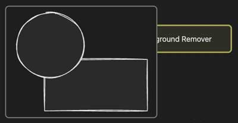
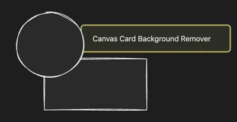

# Obsidian Canvas Card Background Remover Plugin

This Obsidian plugin allows you to make the background of cards transparent
in the Canvas for specific embed types, including Image (png), Canvas, and even Markdown.

## Usage

Find and install the plugin within Obsidian's community plugin browser.

After installation, open a canvas document to see the background removed
from embedded cards that have a transparent background.

| Status  | Screenshot                       |
|:-------:|:--------------------------------:|
| OFF     ||
| ON      |   |

The plugin primarily affects Images and Canvases.
You can customize the card types to have a transparent background in the settings page.

### How to change the label's visibility?

Change it in the Settings > Canvas > Display Card Label

## Support

